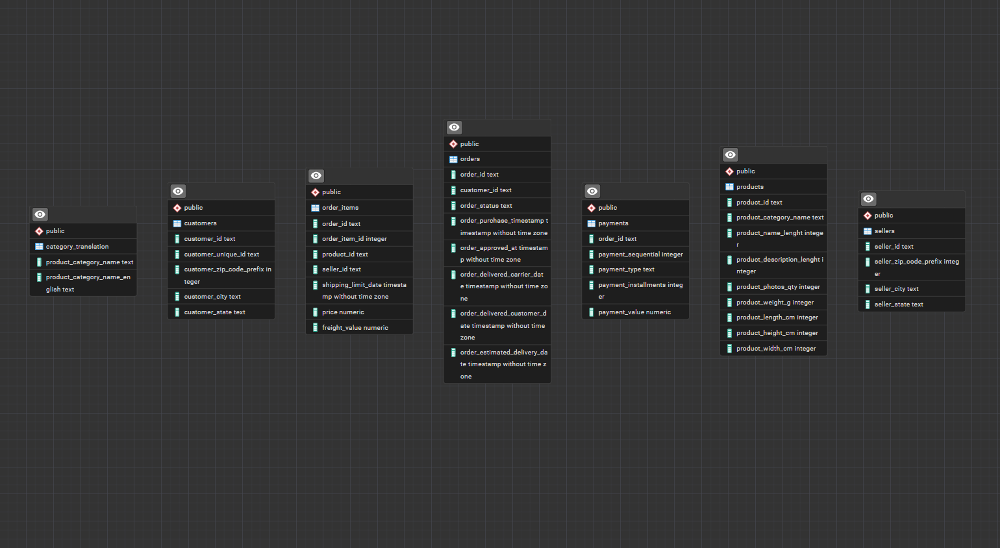
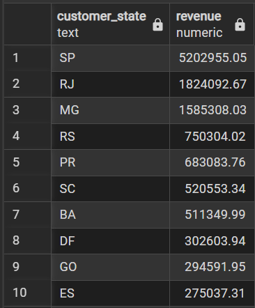
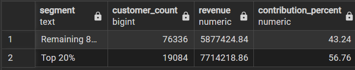
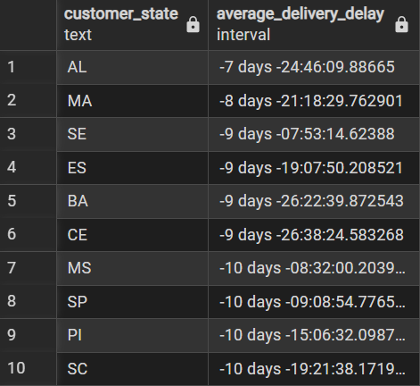

# 🛒 Olist SQL Analysis

<p align="center">
  <b>Business Analysis of the Olist Brazilian E-commerce Dataset using PostgreSQL</b>
</p>

<p align="center">
  SQL • PostgreSQL • Business Analytics • Data Analysis
</p>

---

# 📌 Project Overview

This project focuses on analyzing the **Olist Brazilian E-commerce Dataset** using **PostgreSQL** to solve real-world business problems.

Instead of writing only SQL queries, the project follows a **business-driven approach**, where each query answers an important business question related to revenue, customer behavior, sales performance, and operational efficiency.

---

# 🎯 Project Objectives

- Analyze sales performance across different states.
- Understand customer purchasing behavior.
- Identify top-performing customers.
- Evaluate Average Order Value (AOV).
- Discover high-revenue product categories.
- Analyze delivery performance.
- Solve real-world business problems using SQL.

---

# 🛠️ Tools & Technologies

- PostgreSQL
- pgAdmin 4
- SQL
- Git
- GitHub

---

# 📂 Dataset Information

**Dataset:** Olist Brazilian E-commerce Dataset

The project uses multiple related tables including:

- Customers
- Orders
- Order Items
- Products
- Sellers
- Payments
- Category Translation

---

# 🗂️ Database Schema

<p align="center">

</p>

---

# 📁 Project Structure

```text
olist-sql-analysis
│
├── SQL
│   ├── 01_Basic_Business_Questions.sql
│   ├── 02_Intermediate_Business_Questions.sql
│   └── 03_Advanced_Business_Questions.sql
│
├── images
│   ├── schema.png
│   ├── revenue_by_state.png
│   ├── top20_customer_contribution.png
│   └── delivery_delay.png
│
└── README.md
```

---

# 📊 Business Questions Solved

## 🔹 Basic Business Questions

- Find Total Customers
- Find Total Orders
- Calculate Total Revenue
- Revenue by State
- Orders by State

---

## 🔹 Intermediate Business Questions

- Revenue by Product Category
- Monthly Revenue Trend
- Top 10 Customers by Revenue
- Product Category Revenue Ranking
- One-time vs Repeat Customers

---

## 🔹 Advanced Business Questions

- Top 20% Customer Revenue Contribution
- Revenue vs Orders vs Average Order Value (AOV)
- High Revenue but Low Sales Volume Categories
- Average Delivery Delay by State
- High Order Frequency but Low Revenue Customers

---

# 📷 Sample Outputs

## Revenue by State

<p align="center">

</p>

---

## Top 20% Customer Contribution

<p align="center">

</p>

---

## Average Delivery Delay by State

<p align="center">

</p>

---

# 💡 Key Business Insights

- São Paulo (SP) generated the highest revenue among all states.
- Revenue growth is driven by both order volume and Average Order Value (AOV).
- A small percentage of customers contribute a significant portion of total revenue.
- Some product categories generate high revenue despite relatively low sales volume.
- Delivery performance varies across states, indicating operational improvement opportunities.
- The majority of customers are one-time buyers, suggesting scope for improving customer retention.

---

# 🧠 SQL Skills Demonstrated

### SQL Fundamentals

- SELECT
- WHERE
- ORDER BY
- GROUP BY
- HAVING
- Aggregate Functions

### Joins

- INNER JOIN
- Multi-table Joins

### Intermediate SQL

- CASE WHEN
- Subqueries
- Common Table Expressions (CTEs)

### Advanced SQL

- Window Functions
- ROW_NUMBER()
- DENSE_RANK()
- Ranking
- Revenue Contribution Analysis
- Customer Segmentation
- Business-Oriented SQL Problem Solving

---

# 🚀 Learning Outcomes

Through this project, I strengthened my ability to:

- Write business-oriented SQL queries
- Perform multi-table analysis
- Solve real-world business problems
- Analyze customer purchasing behavior
- Perform sales and revenue analysis
- Use Window Functions for advanced analytics
- Generate actionable business insights using SQL

---


## ⭐ If you found this project helpful, consider giving it a Star.
